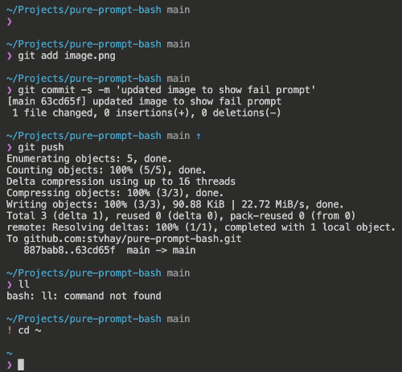

# pure prompt for bash
pure, the minimal prompt for bash

Inspired by [sindresorhus/pure](https://github.com/sindresorhus/pure)

## Install

just clone this repository (or just copy pure.bash) anywhere, and add

    source /path/to/pure.bash

to your `.bashrc`

## Configure

just edit the configuration section in the script to change the way things look a bit

    # color configuration
    declare -A _pure_color=(
        [UNPULLED]=${_pure_color_table[BRIGHT_RED]}
        [UNPUSHED]=${_pure_color_table[BRIGHT_BLUE]}
        [STATUS]=${_pure_color_table[BRIGHT_BLACK]}
        [USER]=${_pure_color_table[BRIGHT_MAGENTA]}
        [ROOT]=${_pure_color_table[BRIGHT_YELLOW]}
        [FAILED]=${_pure_color_table[RED]}
        [PROMPT]=${_pure_color_table[CYAN]}
        [HOST]=${_pure_color_table[WHITE]}
        [MULTILINE]=${_pure_color_table[BLUE]}
        [RESET]=$(tput sgr0)
    )

    # symbol configuration
    declare -A _pure_symbol=(
        [PROMPT]="❯"
        [PROMPT_FAIL]="!"
        [UNPULLED]="⇣"
        [UNPUSHED]="⇡"
        [DIRTY]="*"
        [STASH]="≡")

## Uninstall

just remove what you downloaded, and delete `source` command from your `.bashrc`

## License

MIT License. See LICENSE.
